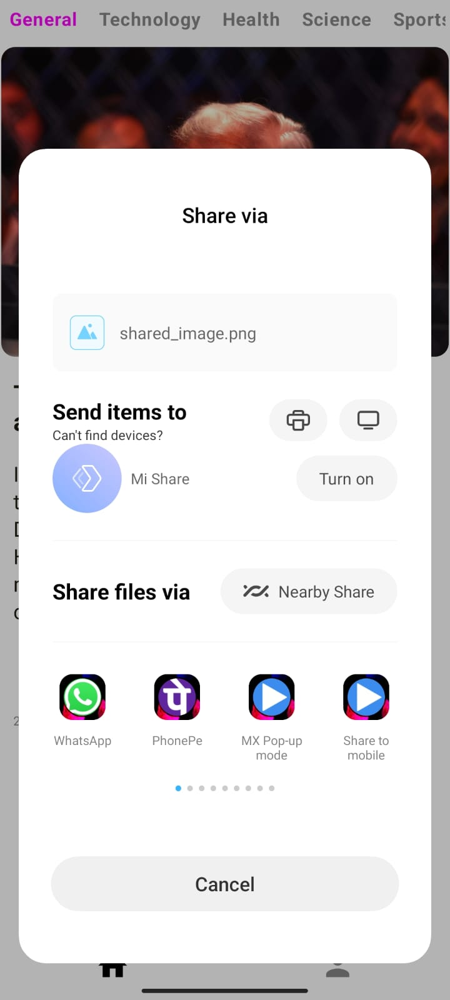
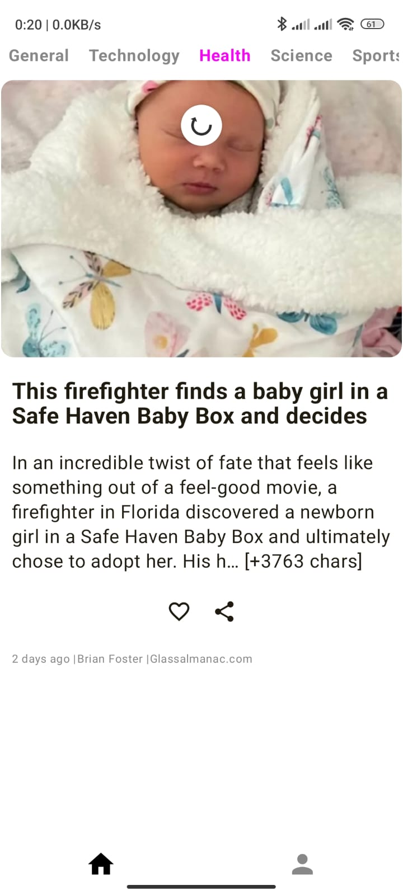

## 📱 Screenshots

### 🟣 Splash & Onboarding

<table>
  <tr>
    <td><b>Splash</b></td>
    <td><b>Onboarding 1</b></td>
    <td><b>Onboarding 2</b></td>
    <td><b>Onboarding 3</b></td>
  </tr>
  <tr>
    <td></td>
    <td></td>
    <td></td>
    <td></td>
  </tr>
</table>

---

### 🟢 Home & Category

<table>
  <tr>
    <td><b>Home</b></td>
    <td><b>Category</b></td>
  </tr>
  <tr>
    <td></td>
    <td></td>
  </tr>
</table>

---

### 🔵 Features

<table>
  <tr>
    <td><b>Saved Articles</b></td>
    <td><b>Share Button</b></td>
    <td><b>Share Message</b></td>
  </tr>
  <tr>
    <td></td>
    <td></td>
    <td></td>
  </tr>
</table>

---

### 🔁 Swipe to Refresh

  

