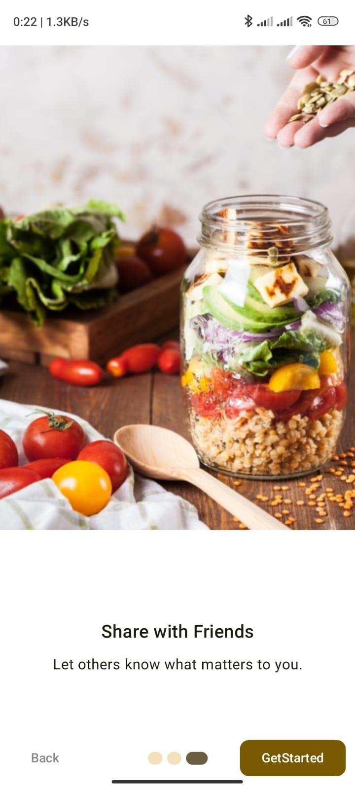
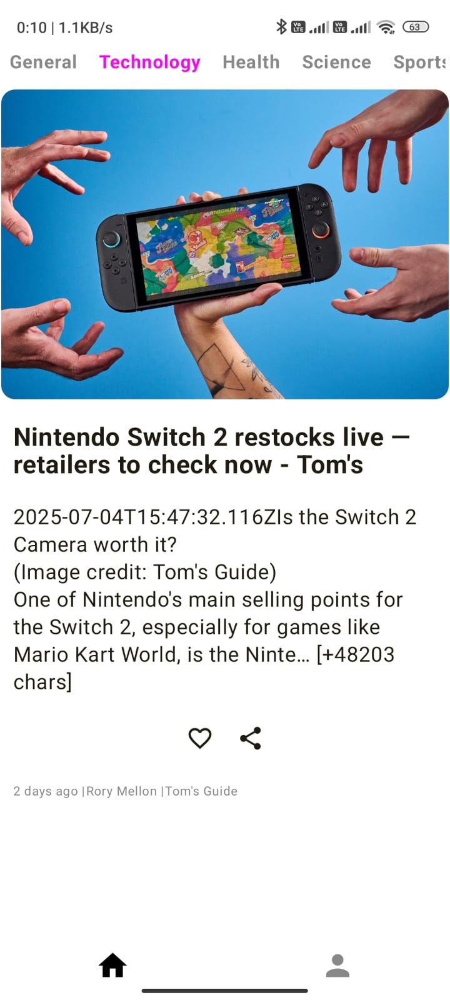

# 📲 MyNews - Jetpack Compose News App

MyNews is a modern, clean, and lightweight news app built using **Jetpack Compose**, **NewsAPI**, **Room**, and **MVVM architecture**. It delivers the latest headlines in under 50 words with an intuitive and minimal interface.

---

## 🚀 Features

- ✅ Onboarding screen for first-time users
- 📰 Latest news powered by [NewsAPI.org](https://newsapi.org)
- ♾️ Infinite scroll with paginated API fetch
- ♻️ **Swipe down to refresh feed manually**
- 🧠 Intelligent random article display (no repeats per session)
- ❤️ Like and save articles (persisted via Room database)
- 📦 Offline Room support for liked news
- 🌙 Dark/Light Theme support
- 📤 Share articles
- 🎬 Image and video support (via Coil + ExoPlayer)
- 📱 Built fully using Jetpack Compose

---

## 🛠 Tech Stack

| Layer         | Tools & Libraries                            |
|---------------|----------------------------------------------|
| UI            | Jetpack Compose, Material3, Accompanist      |
| Architecture  | MVVM, StateFlow, ViewModel                   |
| Backend/API   | NewsAPI.org via custom Retrofit wrapper      |
| Local Storage | Room Database                                |
| Navigation    | Navigation Compose                           |
| State Saving  | DataStore Preferences                        |
| Media         | Coil (Image), ExoPlayer (Video)              |

---

## 📱 Screenshots

### 🟣 Splash & Onboarding

| Splash                            | Onboarding 1 | Onboarding 2                             | Onboarding 3                             |
|-----------------------------------|--------------|------------------------------------------|
|  |  |  |  |

---

### 🟢 Home & Category

| Home                          | Category |
|-------------------------------|----------|
|  |  |

---

### 🔵 Features

| Saved Articles | Share Button | Share Message |
|----------------|--------------|----------------|
|  |  |  |

---

| Swipe to Refresh |
|------------------|
|  |

---

## 🔄 Navigation Flow

```text
            ┌─────────────────────────┐
            │     OnBoardingScreen    │ ◄────────────┐
            └────────────┬────────────┘              │
                         │                           │
            ┌────────────▼────────────┐              │
            │        HomeScreen       │              │
            └────────────┬────────────┘              │
                         │                           │
               ┌─────────▼─────────┐      ┌──────────▼─────────┐
               │ Vertical NewsFeed │◄────▶│    LikedScreen     │
               └───────────────────┘      └────────────────────┘
